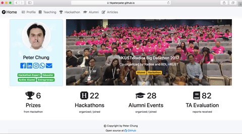

## Personal website built by Hugo

Demo: [https://hkpeterpeter.github.io](https://hkpeterpeter.github.io)

## Setup and build steps

## Reference

- [Hugo](https://gohugo.io/) - an extremely fast static site generator
- [Bootstrap 4](https://gohugo.io/) - responsive front-end library
- [Font Awesome 5](https://fontawesome.com/) - vector icon library
